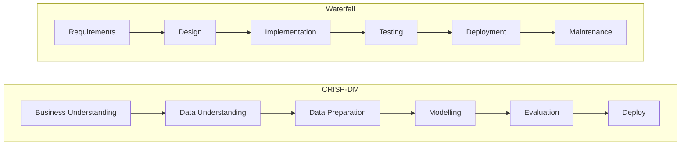
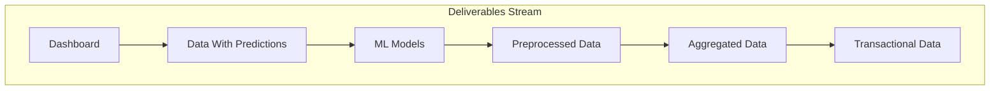
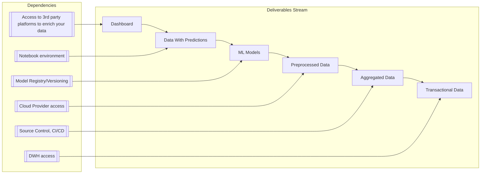

## Conway's Law Strikes Again

I was once involved in a project that was cancelled midway. The organization I was working with had big communication problems between departments, and one particular division of the company was creating problems, preventing us from accessing the data we needed to do our work.

Because we never had access to the data we needed, we had to content ourselves with shipping dummy models trained on dummy data, documentations and presentations. In one of our internal meetings, someone mentioned a Product research methodology called "Slicing" which I wasn't familiar with.

## What is Slicing?

If you're familiar with the usual DS methodologies like [CRISP-DM](http://cs.unibo.it/~danilo.montesi/CBD/Beatriz/10.1.1.198.5133.pdf) or [TDSP](https://learn.microsoft.com/en-us/azure/architecture/data-science-process/overview), you'll know there's a lot of prep work to be done before you can start the "actual" work. For the seasoned SWE, they look a lot like waterfall.

*
Diagram 1: CRISP-DM vs Waterfall. In theory after evaluation you're supposed to go back to Business Understanding. In practice that rarely happens. 
*

The Data Science Process Alliance describes a type of Slicing process, but it is fundamentally flawed. Hear me out. Let's look at their approach:

*
Figure 1: <a href="https://www.datascience-pm.com/crisp-dm-2/" target="_blank">CRISP-DM Vertical Slicing</a>. What happens with all the roadblocks and internal frictions that will inevitably happen while you work at the first vertical (Voluntary Churn)? What if you're blocked for half the duration of the project, what will you deliver/work on?
*

It is true that these methodologies have clear project outlines though. Each step is clear, and the documented output of each step is the output of the next. But sometimes, by the time you get to the evaluation, weeks have gone by and the deadline is looming.

That is, if you even get to the evaluation because many scientists will only get to modelling once the data is perfect. The problem is that for many companies that are on a more premature stage of their digital transformation (DX) journey, the data is not gonna be ready, and it will not be any time soon. Should that hinder your ability to deliver value to their business? Of course not.

A colleague of mine recently shared the famous quote "Rome wasn't built in a day, but they were laying bricks every hour". Following the metaphor, the mature process of a Data team would be able to start laying bricks from day one.

### Slicing 101

According to Nate Bauer [[1]](#references) (emphasis added for context):

> Slicing is a methodology that streamlines a UX designer’s efforts into **a single deliverable** and facilitates a lean and agile environment while **effectively communicating** with all roles within a product team.

Is it just a glorified Agile methodology with a design twist? Not quite. There are key aspects of methodologies like Scrum that don't fit a regular DS workflow (or design for that matter):

- Time Boxing: one of the foundation principles of agile methodologies is packing up tasks in a limited time frame. This rarely works for data science though, since insights uncovered while investigating the data can spin a project on its head. You may go in a project looking to predict churn, and end up with a ad recommendation strategy.
- Complex Domain: Scrum expects developers to be in the empirical world, which is a lot more predictable than what we would call the Chaotic project domain. I believe most DS projects fall into the Chaotic domain.
- Effort Estimation: Estimating data work is extremely hard, and often imprecise. There are so many unknowns when dealing with a dataset, often even the very people who created the data aren't aware of its limitations and caveats.  

So if Design teams also share these same problems, how does Slicing addresses them? Here's Nate again [[1]](#references):

> Slicing is a methodology that involves **breaking down design work** to align with an agile workflow. This approach efficiently addresses the communication challenges mentioned earlier while providing clear design and necessary documentation. It enables teams to **measure** the amount of effort required for each sprint and **prioritize** which components of an application should be developed first.

To summarize, we need to work on "small, single, measurable, well communicated deliverables. Slicing starts with a **complete** (think end-to-end) design of the system (called a Slice) and in each iteration (a new Slice) the changes are clearly communicated using a color coding system (existing feature, new, in review, and removed). This *single deliverable* is what is so critical, and missing from traditional methodologies.

Starting with an E2E iteration reduces drastically the complexity, and gives you a ready (though most likely incorrect) deliverable. The value of this first "Slice" of data science deliverable would be questionable, yes, but it has several benefits:

- Clients can spot right away what the end deliverable will look like, and guide the team in the right direction;
- The team doesn't get stuck on issues like data quality, data access, compute resources, or cloud environments;
- Most of the blockers and bottlenecks will show up on the first iterations, as opposed to the later ones.
- The project has a continuous momentum, and the team starts more motivated (we all love seeing the results of our work).

The Slicing method also has coding for approval status (also very applicable to data science) depending on whether a slice has been approved (green), ready for review (yellow), or not approved (red).

## Slicing In Practice

Imagine a sneakers e-commerce platform hired you to forecast their quarterly. You're hired from today, however you'll only receive access to their data lake in 4 weeks because the Data Steward is OOO. The first step is identifying the deliverables of the project. 

### Data Science Deliverables

If we work our way backwards, we can start from a dashboard and work our way upstream:

*
Diagram 2: Data Project Deliverables
*

How can you get ahead of your delivery, without even knowing what the data looks like? You can start iterating on your Slices and start to **build consensus** on what the final deliverable will be. You can take the opportunity to provision everything else you'll need, for instance:

*
Diagram 2: Data deliverables and their dependencies
*

And there are so many more things that can completely stall a data project, each project will have its own challenges. 

### The Importance Of Momentum

The more innovative your project is, the more a company's structure will resist against it being built. Remember Conway's law [[2]](#references):

> Organizations which design systems are constrained to produce designs which are copies of the communication structures of these organizations.

There's also another very powerful aspect of this that unfortunately is not the case for Design. The first Slice of each type of project is reusable. The ETL code, the DBT project, the model, the dashboard, all of these can be reused to build momentum on other projects too, as long as the tech stack is the same. They can also lay the groundwork to deal with the four V's of Big Data (Volume, Velocity, Variety, Veracity). This was the base of one of Saltz's arguments against CRISP-DM [[3]](#references).

### The First Slices

What could the very first Slice look like in practice? It's important that it's 100% local (even if you already have all the cloud access you need). Here's a possible example:

| Slice | Data Source | Data Platform | SQL Framework | ETL Environment | Streaming Environment | Orchestration | Notebook Environment | Data Lake | Model | Dashboard Environment | Dashboard |
|-------|-------------|--------------|---------------|-----------------|----------------------|--------------|---------------------|-------|----------------------|----------| --- |
| 1 | Transactional Data Generated With Faker | Local SQLite | DBT | Local Spark Cluster | Local Kafka | Local Airflow | Local Jupyter | `moto` S3 | Random Forest | Local Streamlit | Bare bones wireframe |
| ... | 
| N | Client's full transactions data | Client's Redshift | DBT running on client's CD infra | Client's Airflow Cluster | Client Kafka | AWS MWAA | Client's SageMaker | AWS S3 | Feature Selection, Grid Search, Hyperparameter tuning | Tableau | Finalized Dashboard |

Each progressive Slice would move the project closer to the desired state (in this example, everything running under the client's infra). If you look back at [Figure 1](#crisp-dm-slicing), it's like we're building all 18 squares at the same time, but slowly. It's easy to see how this first layer is easy to estimate, and I would even argue a seasoned Data Scientist can do all this in a week. The key here is that not only does the first slice remove complexity from the estimation of the initial work, it also reduces the complexity of every single following slice, making them easier to estimate and prioritize.

## Implementation

While I would have loved to provide an actual implementation with this post, I couldn't find the time, and wanted to post this sooner than later. I'll leave this section here as a placeholder for a future me to fill with a nice github link and code block.

The way I see this working is an opinionated, Omakase-style (see [omakub](https://world.hey.com/dhh/introducing-omakub-354db366)) python [cookiecutter](https://cookiecutter.readthedocs.io/) project. Instead of one template for each type of project, it would contain one mega-project (potentially with cookiecutter CLI options to trim it).

## References

[1] N. Bauer, "Slicing", 2023 https://nabauer.com/slicing/  
[2] M. E. Conway, "How Do Committees Invent?", 1968 http://www.melconway.com/Home/Committees_Paper.html  
[3] J. S. Saltz and I. Shamshurin, "Big data team process methodologies: A literature review and the identification of key factors for a project's success," 2016 https://ieeexplore.ieee.org/abstract/document/7840936  
