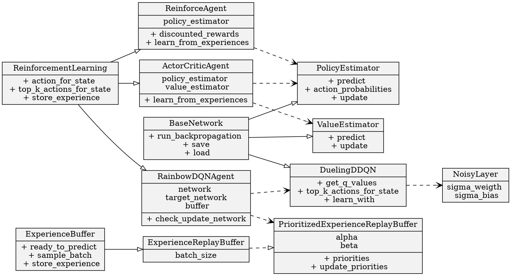

1. Do not remove this line (it will not be displayed)
{:toc}


*Almost time to say Happy New Year. This year my goal was to write one article per month, and looks like I did it.
I will double down in 2026, and continue to write more and more. Got 2 articles in the chamber right now, 
but for this one I will keep it short.*


----

If you've read my other posts, you've probably seen by the equations that I'm a fan of latex. The last significant document I wrote was my thesis. While writing, I learned a lot of ways to improve my Latex setup. This is a list of things I've personally found particularly useful, for future reference. 


## File Structure

I like working with each chapter being it's own file. Preamble, license, and bibliography should also be their own files. The way I like to do it is naming them numerically, so when you see them in a file explorer they are in order (e.g., 01_introduction.tex, 02_background.tex).

Then, you would have a main document where you can import them like so:

```latex
% abstract
\input{0_abstract.tex}
```

## Glossary

I like creating and organizing acronyms and glossary entries. For this, I use a special package. This is how it works: in your main document you import it, and before starting the document you import the glossary file.

```latex
\usepackage{acronym}
\usepackage[acronym]{glossaries}
...
% Glossary (before init document)
\input{glossary.tex}
...
% Inside init document, where you want the glossary to be
\clearpage
\phantomsection
\addcontentsline{toc}{chapter}{Glossary}
\printglossary
\addcontentsline{toc}{chapter}{Acronyms}
\printglossary[type=\acronymtype]
% Exclude the extra glossary empty page
\let\cleardoublepage\clearpage
```

The glossary file is where you define your acronyms and glossary entries. For example:

```latex
% Acronyms
\newacronym{trpo}{TRPO}{Trust Region Policy Optimization}\
...
% Glossary Entries
\newglossaryentry{coldstartproblem}
{
    name=Cold-Start Problem,
    description={is a problem of recommendation systems that emerges when recommendations need to be made for a user who we don't have enough data about}
}
...
% Initialize
\makeglossaries
```
Finally, in your text, when you reference any acronym or glossary entry, you can do it like so:

```latex
% short acronym and long form
\acrshort{trpo} \acrlong{trpo}
% full acronym
 \acrfull{trpo}
% glossary entry
\gls{coldstartproblem}
```

## Figures

This is straighforward, but this is how I like to import figures. I like to organize them in a folder called `figs`. I always include a caption, and don't really like inline figures.

```latex
\begin{figure}[!htbp]
	\centering
	\includegraphics[width=0.9\textwidth]{figs/timeline.pdf}
	\caption{Timeline of development of the work.}
	\label{fig:timeline}
\end{figure}
```

## Tables (from CSV)

I like having CSV behind my tables. This way you can edit them separately, and not have to deal with latex syntax. All CSV's would be in their own `csv` folder. This is how you would import the package:

```latex
\usepackage{csvsimple}
\usepackage{booktabs}
\usepackage{cleveref}
```

Then you can create the table. Remember to add a caption and a label.

```latex
% Create table
\begin{table}[!htbp]
\centering
\begin{tabular}{l}
\csvautotabular{csv/utilitymatrix.csv}
\end{tabular}
\caption{Example of a $N \times M$ Utility Matrix. Cell values represent utility or relevance, for instance how many times the user at that row clicked on the product at that column. Note that in practice, this is often a very sparse matrix.}
\label{table:utilitymatrix}
\end{table}
...
% Reference the table later
\cref{table:utilitymatrix}
```

## Diagrams as code (via graphviz and PDF)

As you saw in section 3, I use all my figures as vectors, and therefore PDF's. I never use rendered image formats (i.e., png, jpg.). You can also define diagrams as dot files, and have your latex editor render them to PDF on the fly ([example reference](https://www.davidpace.de/including-dot-graphs-as-postscript-files-in-latex-documents/)). Then you just import the resulting PDF. Here's an example dot file, called `class_diagram.dot` under a folder called `figs`:



In theory you can define your diagrams inline in latex, but I prefer to use separate dot files. It can be rendered like so:

```latex
% Import the library in the main tex file
\usepackage{epsfig, amsmath}
\usepackage[pdf]{graphviz}
% Use the generated (vector) PDF
\begin{figure}[!ht]
	\centering
	\includegraphics[width=1\textwidth]{figs/class_diagram.pdf}
	\caption{Class diagram covering the most important parts of the implementation.}
	\label{fig:classdiagram}
\end{figure}
```

## Algorithms

I really like a well formatted algorithm. Here is how I like to do it:

```latex
% Import the package
\usepackage[ruled,vlined]{algorithm2e}
% Declare the algorithm
\begin{algorithm}[!ht]
\SetAlgoLined
 Let $Q_{\theta}$ be the main network with weights $\theta$ and noisy layers with noise $\sigma$\;
 Let $Q'_{\theta'}$ be the target network\;
 Let PER be the prioritized experience buffer of size $N_D$, burn-in $N_{in}$, batch size $N_{batch}$, priority importance $\alpha$, weight effect $\beta$, annealing $\beta_a$, and minimum priority $\epsilon$\;
 Let $P$ be the priorities of the experiences of PER\;
 Let $F_{train}$ be the frequency at which the main network is trained\;
 Let $F_{sync}$ be the frequency at which the target network is updated\;
 Let $c$ be the step count\;
 Let $\eta$ be the learning rate\;
 \For{each Time-Step $t$, $S_t$, $\gamma_t \in (0,1)$}{
 	Let $ready \leftarrow (|PER| > N_{in})$\;
 	Let $A_t$ be $argmax\,Q'_{\theta'}(S_t)$ if $ready$ else a random valid action\;
	Let $R_t$, $S_{t+1}$ be the environment's reward and next state for $A_t$\;
 	\If{$ready$}{
		$c \leftarrow c + 1$\;
		\If{$c \bmod F_{train} = 0$}{
			Let $\Pi \leftarrow P^{\alpha}$\;
			Let $b$ be a randomly sampled batch of size $N_{batch}$ from $PER$ using probabilities $\Pi$\;
			\tcp{Importance Sampling}
			Let $w^{b} \leftarrow (\frac{1}{N_{batch}} \frac{1}{P_b})^\beta$ be their weights\;
			\tcp{Weight annealing}
			$\beta \leftarrow min(\beta + \beta_a, 1)$\; 
			\tcp{TD Error following the DDQN update}
			Let $\delta \leftarrow Q_{\theta}(S^b, A^b) - \gamma_t\,Q'_{\theta'}(S'^b, argmax\,Q_\theta(S^b)) + R^b$\;
			\tcp{Weighed mean square errors}
			Apply gradient descent $\theta \leftarrow \theta\,\eta\,\frac{(\delta^2\,w^b)}{|b|}\,\nabla_{\theta}\,Q_{\theta}(S^b, A^b)$\;
			$P_i \leftarrow \delta_i + \epsilon$ for every experience $i$ in $b$\;
		}
 		\If{$c \bmod F_{sync} = 0$}{
			\tcp{Target network update, copy the weights $\theta$ over to $Q'$}
			$\theta' \leftarrow \theta$\;
		}
	}
	Store $(S_t$, $S_{t+1}, A_t, R_t)$ in PER with priority $max(P)$\;
 }
 \caption{Dueling DQN with Prioritized Experience Buffer and Noisy Layers}
 \label{algo:dueling}
\end{algorithm}
% reference it later (cleveref)
\cref{algo:dueling}
```

## Rendering plots to PDF

I use Python in my work, and I render my plots to PDF directly from code. Here's how I do it using `matplotlib` and `seaborn`. A good practice here is to have your code save the underlying data for the plot in CSV. Then, with a collection of CSV's, you render them to PDF one at a time when building your tex documents.

```python
import pandas
import seaborn as sns
import matplotlib.pyplot as plt
sns.set(rc={'figure.figsize':(12,4)})
sns.set_context("paper")
sns.set_style("white")
sns.color_palette("Set2")
metrics = pandas.read_csv('output/all_metrics_test.csv', index_col=0)
plot = sns.lineplot(data=metrics, x="episode", y="measurement", hue='model', ci=95, legend='full')
plot.set(xlabel='Episodes', ylabel='Episode Total Reward Moving Average')
plt.savefig("output/preliminary_results.pdf")
```
This gets you a clean, labelled vector plot that will look great in a PDF paper.


## Theorems, Definitions, and Proofs

For theorems, here's how I do it:

```latex
\usepackage{amsthm}
...
% Example definition
\begin{definition}[The Recommender System Problem]
\label{def:recsysproblem}
To deliver a set of items, to a set of users, optimizing a set of goals.
\end{definition}
```

## Appendices

First we would need to use the package, and import the appendices file:

```latex
\usepackage[toc]{appendix}
...
% appendix
\input{appendixes.tex}
```

Then in your appendices file:

```latex
\begin{appendices}
\chapter{Network Architectures}
\label{ap:architectures}
...
\end{appendices}
```

## Footnotes

This is built-in behaviour, but I thought I'd add it anyway, because I like footnotes:

```latex
The code is made publicly available on the source-control management platform 
\textit{Github}\footnote{\href{https://github.com/luksfarris/pydeeprecsys}{github.com/luksfarris/pydeeprecsys}} 
and the notebooks are provided for reproducibility.
```

## Bibliography

In your main file declare the references:

```latex
\addcontentsline{toc}{chapter}{Bibliography}
\bibliographystyle{unsrtnat}
\bibliography{references}
```

In your references.bib file, declare the references (I'm including a bunch for future reference). These should never be written manually. Always use a citation manager (see appendix A of this essay).

```bibtex
@book{lucene,
	edition = {2nd},
	title = {Lucene in {Action}},
	abstract = {Lucene in Action, Second Edition Michael McCandless, Erik Hatcher \& Otis Gospodnetic},
	language = {en},
	publisher = {Manning Publications},
	author = {Gospodnetic, Otis and Hatcher, Erik and McCandless, Michael},
	year = {2010},
}

@article{mars,
	title = {MARS-{Gym}: {A} {Gym} framework to model, train, and evaluate {Recommender} {Systems} for {Marketplaces}},
	shorttitle = {MARS-{Gym}},
	abstract = {Recommender Systems are especially challenging for marketplaces since they must maximize user satisfaction while maintaining the healthiness and fairness of such ecosystems. In this context, we observed a lack of resources to design, train, and evaluate agents that learn by interacting within these environments. For this matter, we propose MARS-Gym, an open-source framework to empower researchers and engineers to quickly build and evaluate Reinforcement Learning agents for recommendations in marketplaces. MARS-Gym addresses the whole development pipeline: data processing, model design and optimization, and multi-sided evaluation. We also provide the implementation of a diverse set of baseline agents, with a metrics-driven analysis of them in the Trivago marketplace dataset, to illustrate how to conduct a holistic assessment using the available metrics of recommendation, off-policy estimation, and fairness. With MARS-Gym, we expect to bridge the gap between academic research and production systems, as well as to facilitate the design of new algorithms and applications.},
	journal = {arXiv:2010.07035 [cs, stat]},
	author = {Santana, Marlesson R. O. and Melo, Luckeciano C. and Camargo, Fernando H. F. and Brandão, Bruno and Soares, Anderson and Oliveira, Renan M. and Caetano, Sandor},
	month = sep,
	year = {2020},
	keywords = {Computer Science - Machine Learning, Computer Science - Human-Computer Interaction, Computer Science - Information Retrieval, H.4.2, I.6.5, Statistics - Machine Learning},
	file = {arXiv Fulltext PDF:/Users/farris/Zotero/storage/UK5DTLV2/Santana et al. - 2020 - MARS-Gym A Gym framework to model, train, and eva.pdf:application/pdf;arXiv.org Snapshot:/Users/farris/Zotero/storage/IYSX6NAS/2010.html:text/html},
}


@proceedings{challenge, 
	title = {RecSys Challenge '19: Proceedings of the Workshop on ACM Recommender Systems Challenge}, 
	year = {2019}, 
	isbn = {9781450376679}, 
	publisher = {Association for Computing Machinery}, 
	address = {New York, NY, USA}, 
	abstract = {The RecSys Challenge is an annual competition that focuses on the design and development of the best performing recommendation algorithms for a particular scenario. It has begun in 2010 and until 2019 the challenge has experienced considerable growth in the interest of the community and has drawn a lot of participants from industry and academia.}, 
	location = {Copenhagen, Denmark} 
}


@inproceedings{recsysmetrics,
	title = {Beyond accuracy: {Evaluating} recommender systems by coverage and serendipity},
	shorttitle = {Beyond accuracy},
	booktitle = {Proceedings of the Fourth ACM Conference on Recommender Systems},
	doi = {10.1145/1864708.1864761},
	abstract = {When we evaluate the quality of recommender systems (RS), most approaches only focus on the predictive accuracy of these systems. Recent works suggest that beyond accuracy there is a variety of other metrics that should be considered when evaluating a RS. In this paper we focus on two crucial metrics in RS evaluation: coverage and serendipity. Based on a literature review, we first discuss both measurement methods as well as the trade-off between good coverage and serendipity. We then analyze the role of coverage and serendipity as indicators of recommendation quality, present novel ways of how they can be measured and discuss how to interpret the obtained measurements. Overall, we argue that our new ways of measuring these concepts reflect the quality impression perceived by the user in a better way than previous metrics thus leading to enhanced user satisfaction.},
	author = {Ge, Mouzhi and Delgado, Carla and Jannach, Dietmar},
	month = jan,
	year = {2010},
	pages = {257--260},
	file = {Full Text PDF:/Users/farris/Zotero/storage/VVDJ2IAF/Ge et al. - 2010 - Beyond accuracy Evaluating recommender systems by.pdf:application/pdf},
}

@misc{openaigym,
  Author = {Greg Brockman and Vicki Cheung and Ludwig Pettersson and Jonas Schneider and John Schulman and Jie Tang and Wojciech Zaremba},
  Title = {OpenAI Gym},
  Year = {2016},
  Eprint = {arXiv:1606.01540},
}
```

Example citations:

```latex
\citet{afkhamizadeh_automated_nodate} % cite paper
\citep[see][chap.~13]{falk_practical_2019} % cite a specific chapter
\citeyear{huang_deep_2021} % cite with year
\cite[chap.~1.7]{reinforcementlearning} % cite specific chapter with parentheses
```

## Appendix A: Citation Manager

Having a way to catalogue your bibliography was essential to me. Storing and organizing my annotated references is very important, and I've used this technique a lot since I left academia. My tool of choice is *Zotero*, and I really recommend it. Maybe it even warrants its own post some day. 

